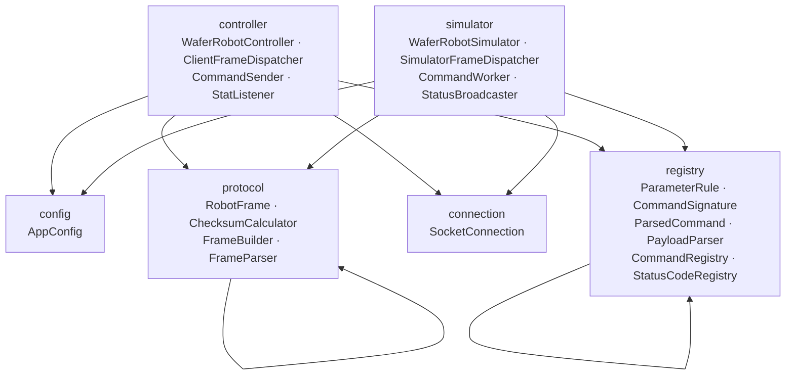
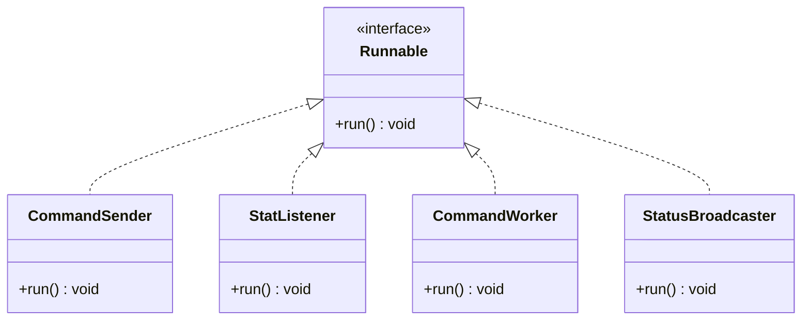

# Wafer Robot Simulator — Class Design Document

## 1. Overview

The system is implemented in Java 17 as a single Maven project. All source code lives under the root package `com.waferrobot`, organized into **6 packages** containing **20 classes**.

### Package Summary

| Package | Classes | Role |
|---|---|---|
| `config` | 1 | Application configuration loading |
| `protocol` | 4 | Frame encoding, decoding, checksum, data model |
| `connection` | 1 | TCP socket communication (server and client modes) |
| `registry` | 6 | Command validation rules and status code lookup |
| `controller` | 4 | Controller application — TCP server, stdin input loop |
| `simulator` | 4 | Simulator application — TCP client, command execution |

### Package Layer Diagram



---

## 2. Class Hierarchy

### 2.1 Interface Implementations

Four classes implement `java.lang.Runnable`. Each is designed to run in a dedicated thread.



| Class | Package | Thread role | Thread type |
|---|---|---|---|
| `CommandSender` | `controller` | Sends CMD frame, waits for ACK/NAK | Regular (per command) |
| `StatListener` | `controller` | Receives EVT and STAT frames | Daemon (application lifetime) |
| `CommandWorker` | `simulator` | Simulates 4s processing, sends EVT | Regular (per command) |
| `StatusBroadcaster` | `simulator` | Sends periodic STAT frames | Daemon (application lifetime) |

### 2.2 Entry Point Classes

| Class | Package | Method | Role |
|---|---|---|---|
| `WaferRobotController` | `controller` | `main(String[] args)` | TCP Server, stdin command loop |
| `WaferRobotSimulator` | `simulator` | `main(String[] args)` | TCP Client, command validation loop |

### 2.3 Standalone Classes (no interface)

| Class | Package | Role |
|---|---|---|
| `AppConfig` | `config` | Loads `.properties` files |
| `RobotFrame` | `protocol` | Immutable frame data class |
| `ChecksumCalculator` | `protocol` | XOR checksum utility |
| `FrameBuilder` | `protocol` | Builds outbound frame strings |
| `FrameParser` | `protocol` | Parses raw frame strings |
| `SocketConnection` | `connection` | TCP send/receive wrapper |
| `ParameterRule` | `registry` | Parameter rule data class |
| `CommandSignature` | `registry` | Command definition data class |
| `ParsedCommand` | `registry` | Parsed payload data class |
| `PayloadParser` | `registry` | Parses payload into ParsedCommand |
| `CommandRegistry` | `registry` | Loads robot.cfg, runs validation |
| `StatusCodeRegistry` | `registry` | Loads error_codes.csv, code lookup |
| `ClientFrameDispatcher` | `controller` | Routes incoming frames on Controller side |
| `SimulatorFrameDispatcher` | `simulator` | Routes incoming frames on Simulator side |

---

## 3. UML Class Diagram

```mermaid
classDiagram
    direction TB

    %% ── Runnable interface ──────────────────────────────────
    class Runnable {
        <<interface>>
        +run() void
    }

    %% ── config ──────────────────────────────────────────────
    class AppConfig {
        -Properties properties
        +load(filename: String) void
        +getProperty(key: String) String
        +getProperty(key: String, defaultValue: String) String
        +getInt(key: String) int
    }

    %% ── protocol ────────────────────────────────────────────
    class RobotFrame {
        <<final>>
        -String messageType
        -int sequenceId
        -String payload
        -String hexChecksum
        -boolean isValid
        +getMessageType() String
        +getSequenceId() int
        +getPayload() String
        +getHexChecksum() String
        +isValid() boolean
    }

    class ChecksumCalculator {
        +calculate(coreData: String) String
    }

    class FrameBuilder {
        -ChecksumCalculator checksumCalculator
        +build(messageType: String, sequenceId: int, payload: String) String
        +build(messageType: String, sequenceId: int) String
    }

    class FrameParser {
        -ChecksumCalculator checksumCalculator
        +parse(rawFrame: String) RobotFrame
    }

    %% ── connection ──────────────────────────────────────────
    class SocketConnection {
        -ServerSocket serverSocket
        -Socket socket
        -PrintWriter writer
        -BufferedReader reader
        +listenAndAccept(port: int) void
        +connect(host: String, port: int) void
        +sendFrame(frame: String) void
        +receiveFrame() String
        +close() void
    }

    %% ── registry ────────────────────────────────────────────
    class ParameterRule {
        -String name
        -String hardwareLink
        +getName() String
        +getHardwareLink() String
        +hasHardwareLink() boolean
    }

    class CommandSignature {
        -List~ParameterRule~ required
        -List~ParameterRule~ optional
        +getRequired() List~ParameterRule~
        +getOptional() List~ParameterRule~
    }

    class ParsedCommand {
        -String action
        -Map~String,String~ parameters
        +getAction() String
        +getParameters() Map~String,String~
        +getParameter(key: String) String
        +hasParameter(key: String) boolean
    }

    class PayloadParser {
        +parse(payload: String) ParsedCommand
    }

    class StatusCodeRegistry {
        -Map~Integer,String~ codeToDescription
        -Map~String,Integer~ descriptionToCode
        +loadFromCsv(filename: String) boolean
        +getDescription(code: int) String
        +getCode(description: String) int
        +isCompletionCode(code: int) boolean
        +isErrorCode(code: int) boolean
    }

    class CommandRegistry {
        -Map~String,CommandSignature~ commands
        -Map~String,List~ hardwareLists
        -Map~String,int[]~ numericLimits
        -Map~String,List~ stationArms
        -String lastFailureReason
        -int lastFailureCode
        +loadFromCfg(filename: String) boolean
        +validateSyntax(cmd: ParsedCommand) boolean
        +validateHardwareConstraints(cmd: ParsedCommand) boolean
        +validateNumericLimits(cmd: ParsedCommand) boolean
        +validateStationArmCompatibility(cmd: ParsedCommand) boolean
        +validate(cmd: ParsedCommand) boolean
        +getLastFailureReason() String
        +getLastFailureCode() int
    }

    %% ── controller ──────────────────────────────────────────
    class ClientFrameDispatcher {
        -StatusCodeRegistry statusRegistry
        +dispatch(frame: RobotFrame) void
    }

    class CommandSender {
        -String payload
        -int sequenceId
        -SocketConnection commandConnection
        -FrameBuilder frameBuilder
        -FrameParser frameParser
        -ClientFrameDispatcher dispatcher
        -AtomicBoolean ready
        +run() void
    }

    class StatListener {
        -SocketConnection eventConnection
        -FrameParser frameParser
        -ClientFrameDispatcher dispatcher
        +run() void
    }

    class WaferRobotController {
        +main(args: String[]) void
    }

    %% ── simulator ───────────────────────────────────────────
    class SimulatorFrameDispatcher {
        -CommandRegistry commandRegistry
        -StatusCodeRegistry statusRegistry
        -SocketConnection commandConnection
        -SocketConnection eventConnection
        -FrameBuilder frameBuilder
        -PayloadParser payloadParser
        +dispatch(frame: RobotFrame) void
    }

    class CommandWorker {
        -ParsedCommand parsedCommand
        -int sequenceId
        -SocketConnection eventConnection
        -StatusCodeRegistry statusRegistry
        -FrameBuilder frameBuilder
        +run() void
    }

    class StatusBroadcaster {
        -SocketConnection eventConnection
        -StatusCodeRegistry statusRegistry
        -long intervalMs
        -FrameBuilder frameBuilder
        -AtomicInteger sequenceCounter
        +run() void
    }

    class WaferRobotSimulator {
        +main(args: String[]) void
    }

    %% ── Relationships ────────────────────────────────────────

    %% Realization — Runnable
    Runnable <|.. CommandSender
    Runnable <|.. StatListener
    Runnable <|.. CommandWorker
    Runnable <|.. StatusBroadcaster

    %% Composition — internal ownership
    FrameBuilder *-- ChecksumCalculator
    FrameParser  *-- ChecksumCalculator

    %% Aggregation — holds a collection
    CommandSignature o-- ParameterRule
    CommandRegistry  o-- CommandSignature

    %% Association — held as fields
    ClientFrameDispatcher --> StatusCodeRegistry
    CommandSender --> SocketConnection
    CommandSender --> FrameBuilder
    CommandSender --> FrameParser
    CommandSender --> ClientFrameDispatcher
    StatListener  --> SocketConnection
    StatListener  --> FrameParser
    StatListener  --> ClientFrameDispatcher
    SimulatorFrameDispatcher --> CommandRegistry
    SimulatorFrameDispatcher --> StatusCodeRegistry
    SimulatorFrameDispatcher --> SocketConnection
    CommandWorker --> SocketConnection
    CommandWorker --> StatusCodeRegistry
    StatusBroadcaster --> SocketConnection
    StatusBroadcaster --> StatusCodeRegistry

    %% Dependency — creates or uses transiently
    FrameParser       ..> RobotFrame
    PayloadParser     ..> ParsedCommand
    CommandRegistry   ..> ParsedCommand
    SimulatorFrameDispatcher ..> CommandWorker
    SimulatorFrameDispatcher ..> PayloadParser

    %% Entry point wiring
    WaferRobotController ..> AppConfig
    WaferRobotController ..> SocketConnection
    WaferRobotController ..> StatusCodeRegistry
    WaferRobotController ..> FrameBuilder
    WaferRobotController ..> FrameParser
    WaferRobotController ..> ClientFrameDispatcher
    WaferRobotController ..> StatListener
    WaferRobotController ..> CommandSender
    WaferRobotSimulator  ..> AppConfig
    WaferRobotSimulator  ..> SocketConnection
    WaferRobotSimulator  ..> CommandRegistry
    WaferRobotSimulator  ..> StatusCodeRegistry
    WaferRobotSimulator  ..> FrameParser
    WaferRobotSimulator  ..> SimulatorFrameDispatcher
    WaferRobotSimulator  ..> StatusBroadcaster
```



---

## 4. Package-by-Package Class Descriptions

---

### 4.1 `config` Package

| Class | Type | Role |
|---|---|---|
| `AppConfig` | Utility | Loads and exposes `.properties` file values |

#### `AppConfig`

**Purpose:** Reusable configuration loader. Used by both `WaferRobotController` and `WaferRobotSimulator` at startup to read TCP ports, host, and intervals from `app.properties`.

| Field | Type | Description |
|---|---|---|
| `properties` | `Properties` | Loaded key-value pairs |

| Method | Returns | Description |
|---|---|---|
| `load(filename)` | `void` | Loads the `.properties` file; throws `RuntimeException` on failure |
| `getProperty(key)` | `String` | Returns value for key; null if not found |
| `getProperty(key, default)` | `String` | Returns value for key, or the default if not found |
| `getInt(key)` | `int` | Parses and returns an integer property value |

**Relationships:** No dependencies on other project classes. Depended upon by `WaferRobotController` and `WaferRobotSimulator`.

---

### 4.2 `protocol` Package

| Class | Type | Role |
|---|---|---|
| `RobotFrame` | Immutable data class | Holds one parsed protocol frame |
| `ChecksumCalculator` | Utility | XOR checksum computation |
| `FrameBuilder` | Builder | Constructs outbound frame strings |
| `FrameParser` | Parser | Parses raw frame strings into `RobotFrame` |

#### `RobotFrame`

**Purpose:** Immutable value object representing one parsed protocol frame. Produced by `FrameParser` and consumed by dispatchers.

| Field | Type | Description |
|---|---|---|
| `messageType` | `String` | CMD, ACK, NAK, EVT, or STAT |
| `sequenceId` | `int` | Request/response correlation number |
| `payload` | `String` | Command text or status code; may be empty |
| `hexChecksum` | `String` | Received checksum (2-char uppercase hex) |
| `isValid` | `boolean` | True when format and checksum pass |

**Relationships:** Created by `FrameParser`. Consumed by `ClientFrameDispatcher` and `SimulatorFrameDispatcher`.

---

#### `ChecksumCalculator`

**Purpose:** Stateless utility that XOR-folds all characters of a core data string and returns a 2-character uppercase hex result.

| Method | Returns | Description |
|---|---|---|
| `calculate(coreData)` | `String` | XOR of all chars → uppercase hex |

**Relationships:** Composed into `FrameBuilder` and `FrameParser` (both own an instance).

---

#### `FrameBuilder`

**Purpose:** Assembles complete outbound protocol frames in the format `<SOH>TYPE|SEQ|PAYLOAD|CHECKSUM<CR><LF>`. Delegates checksum computation to its internal `ChecksumCalculator`.

| Field | Type | Description |
|---|---|---|
| `checksumCalculator` | `ChecksumCalculator` | Owned instance (composition) |

| Method | Returns | Description |
|---|---|---|
| `build(type, seq, payload)` | `String` | Builds frame with payload |
| `build(type, seq)` | `String` | Builds frame without payload |

**Relationships:** Composes `ChecksumCalculator`. Used by `CommandSender`, `SimulatorFrameDispatcher`, `CommandWorker`, and `StatusBroadcaster`.

---

#### `FrameParser`

**Purpose:** Strips framing characters from a raw frame string, splits fields on `|`, verifies the checksum, and returns a populated `RobotFrame`. Supports both 3-field (no payload) and 4-field (with payload) frame formats.

| Field | Type | Description |
|---|---|---|
| `checksumCalculator` | `ChecksumCalculator` | Owned instance (composition) |

| Method | Returns | Description |
|---|---|---|
| `parse(rawFrame)` | `RobotFrame` | Parses raw string; sets `isValid=false` on error |

**Relationships:** Composes `ChecksumCalculator`. Creates `RobotFrame` instances. Used by `CommandSender`, `StatListener`, and `WaferRobotSimulator`.

---

### 4.3 `connection` Package

| Class | Type | Role |
|---|---|---|
| `SocketConnection` | Service | Reusable TCP socket wrapper (server and client modes) |

#### `SocketConnection`

**Purpose:** A single reusable class that encapsulates a TCP connection. Instantiated twice on each side — once for the command connection (port 5000) and once for the event connection (port 5001). `sendFrame()` is `synchronized` to allow multiple threads to safely share one instance.

| Field | Type | Description |
|---|---|---|
| `serverSocket` | `ServerSocket` | Used in server mode only |
| `socket` | `Socket` | Active connection socket |
| `writer` | `PrintWriter` | Buffered output stream |
| `reader` | `BufferedReader` | Buffered input stream |

| Method | Returns | Description |
|---|---|---|
| `listenAndAccept(port)` | `void` | Server mode: binds port, blocks until client connects |
| `connect(host, port)` | `void` | Client mode: connects to remote host |
| `sendFrame(frame)` | `void` | **Synchronized.** Writes frame to output stream |
| `receiveFrame()` | `String` | Reads until `\r\n`; returns complete raw frame |
| `close()` | `void` | Closes socket and all streams |

**Relationships:** Used by `CommandSender`, `StatListener`, `SimulatorFrameDispatcher`, `CommandWorker`, and `StatusBroadcaster`. Wired by `WaferRobotController` (server mode) and `WaferRobotSimulator` (client mode).

---

### 4.4 `registry` Package

| Class | Type | Role |
|---|---|---|
| `ParameterRule` | Data class | One parameter rule (name + optional hardware link) |
| `CommandSignature` | Data class | A command's required and optional parameter rules |
| `ParsedCommand` | Data class | Parsed payload: action + parameter map |
| `PayloadParser` | Parser | Parses payload string into `ParsedCommand` |
| `CommandRegistry` | Service | Loads `robot.cfg`; runs 4-step validation |
| `StatusCodeRegistry` | Service | Loads `error_codes.csv`; forward and reverse code lookup |

#### `ParameterRule`

**Purpose:** Immutable value object representing one parameter entry from the `[COMMANDS]` section of `robot.cfg`. The optional `hardwareLink` field names a list in `[HARDWARE]` or `[NUMERIC_LIMITS]`.

| Field | Type | Description |
|---|---|---|
| `name` | `String` | Parameter name, e.g. `FROM`, `ARM` |
| `hardwareLink` | `String` | Constraint list name; empty if no constraint |

**Relationships:** Aggregated by `CommandSignature`. Created internally by `CommandRegistry`.

---

#### `CommandSignature`

**Purpose:** Holds the full parameter specification for one command action — a list of required rules and a list of optional rules. Loaded from `robot.cfg` by `CommandRegistry`.

| Field | Type | Description |
|---|---|---|
| `required` | `List<ParameterRule>` | Parameters that must be present |
| `optional` | `List<ParameterRule>` | Parameters that may optionally be present |

**Relationships:** Aggregates `ParameterRule`. Stored in `CommandRegistry`'s commands map.

---

#### `ParsedCommand`

**Purpose:** Immutable data class holding the result of parsing a CMD payload string. Produced by `PayloadParser` and consumed by `CommandRegistry` validation methods and `CommandWorker`.

| Field | Type | Description |
|---|---|---|
| `action` | `String` | Command action, e.g. `PICK`, `MOVE` |
| `parameters` | `Map<String, String>` | Key-value pairs, e.g. `FROM=LPA1` |

**Relationships:** Created by `PayloadParser`. Used by `CommandRegistry` and `CommandWorker`.

---

#### `PayloadParser`

**Purpose:** Stateless parser that splits a raw payload string into an action token and a map of `KEY=VALUE` parameters.

| Method | Returns | Description |
|---|---|---|
| `parse(payload)` | `ParsedCommand` | First token = action; remaining `KEY=VALUE` tokens = parameters |

**Relationships:** Creates `ParsedCommand`. Instantiated internally by `SimulatorFrameDispatcher`.

---

#### `CommandRegistry`

**Purpose:** The command validation engine. Loads all four sections of `robot.cfg` on startup and exposes a 4-step validation pipeline. Tracks the failure code and reason from the most recent failed validation call.

| Field | Type | Description |
|---|---|---|
| `commands` | `Map<String, CommandSignature>` | Action → signature map |
| `hardwareLists` | `Map<String, List<String>>` | Hardware constraint allowed-value lists |
| `numericLimits` | `Map<String, int[]>` | Numeric parameter min/max ranges |
| `stationArms` | `Map<String, List<String>>` | Allowed arms per station |
| `lastFailureReason` | `String` | Human-readable failure description |
| `lastFailureCode` | `int` | Error code for NAK payload |

| Method | Returns | Description |
|---|---|---|
| `loadFromCfg(filename)` | `boolean` | Loads `robot.cfg`; returns false on I/O error |
| `validateSyntax(cmd)` | `boolean` | Checks action exists, required params present, no undeclared params |
| `validateHardwareConstraints(cmd)` | `boolean` | Checks string values against `[HARDWARE]` lists |
| `validateNumericLimits(cmd)` | `boolean` | Checks numeric values within `[NUMERIC_LIMITS]` ranges |
| `validateStationArmCompatibility(cmd)` | `boolean` | Checks ARM against `[STATION_ARMS]` for FROM/TO station |
| `validate(cmd)` | `boolean` | Runs all four steps in sequence |
| `getLastFailureReason()` | `String` | Human-readable reason for last failure |
| `getLastFailureCode()` | `int` | Error code for last failure |

**Relationships:** Aggregates `CommandSignature` (which aggregates `ParameterRule`). Accepts `ParsedCommand` as a parameter to all validate methods. Used by `SimulatorFrameDispatcher` and wired by `WaferRobotSimulator`.

---

#### `StatusCodeRegistry`

**Purpose:** Loads `error_codes.csv` and provides forward lookup (code → description) and reverse lookup (description → code). Shared by both Controller and Simulator sides.

| Field | Type | Description |
|---|---|---|
| `codeToDescription` | `Map<Integer, String>` | Forward lookup table |
| `descriptionToCode` | `Map<String, Integer>` | Reverse lookup table |

| Method | Returns | Description |
|---|---|---|
| `loadFromCsv(filename)` | `boolean` | Loads CSV; returns false on I/O error |
| `getDescription(code)` | `String` | Returns description for code, e.g. `104` → `MISSING_PARAMETER` |
| `getCode(description)` | `int` | Returns code for description; -1 if not found |
| `isCompletionCode(code)` | `boolean` | True if code is in range 200–299 |
| `isErrorCode(code)` | `boolean` | True if code is in range 100–199 |

**Relationships:** Used by `ClientFrameDispatcher`, `CommandWorker`, `StatusBroadcaster`, and `SimulatorFrameDispatcher`.

---

### 4.5 `controller` Package

| Class | Type | Role |
|---|---|---|
| `ClientFrameDispatcher` | Dispatcher | Routes incoming frames to console output |
| `CommandSender` | Runnable | Sends CMD frame and waits for ACK/NAK |
| `StatListener` | Runnable (daemon) | Polls event connection for EVT and STAT |
| `WaferRobotController` | Entry point | TCP Server, stdin input loop |

#### `ClientFrameDispatcher`

**Purpose:** Routes incoming frames from the Simulator by message type and prints a human-readable message. Resolves numeric codes to descriptions via `StatusCodeRegistry`.

| Field | Type | Description |
|---|---|---|
| `statusRegistry` | `StatusCodeRegistry` | For resolving code numbers to descriptions |

| Method | Returns | Description |
|---|---|---|
| `dispatch(frame)` | `void` | Routes ACK/NAK/EVT/STAT; prints result |

**Relationships:** Depends on `StatusCodeRegistry` (constructor injection). Consumes `RobotFrame`. Used by `CommandSender`, `StatListener`, and `WaferRobotController`.

---

#### `CommandSender`

**Purpose:** Implements `Runnable`. One instance is spawned per user command. Sends a `CMD` frame over the command connection, then blocks waiting for the `ACK` or `NAK` response, and dispatches it. Sets the shared `ready` flag on completion to signal the main thread.

| Field | Type | Description |
|---|---|---|
| `payload` | `String` | Command text from user |
| `sequenceId` | `int` | Sequence number for this command |
| `commandConnection` | `SocketConnection` | Command port (5000) |
| `frameBuilder` | `FrameBuilder` | For building CMD frame |
| `frameParser` | `FrameParser` | For parsing ACK/NAK response |
| `dispatcher` | `ClientFrameDispatcher` | For routing response to output |
| `ready` | `AtomicBoolean` | Shared flag; set true when done |

**Relationships:** Implements `Runnable`. Uses `SocketConnection`, `FrameBuilder`, `FrameParser`, `ClientFrameDispatcher`.

---

#### `StatListener`

**Purpose:** Implements `Runnable`. Started as a daemon thread at Controller startup. Continuously polls the event connection (port 5001) for incoming `EVT` and `STAT` frames and dispatches each one via `ClientFrameDispatcher`.

| Field | Type | Description |
|---|---|---|
| `eventConnection` | `SocketConnection` | Event port (5001) |
| `frameParser` | `FrameParser` | For parsing received frames |
| `dispatcher` | `ClientFrameDispatcher` | For routing to output |

**Relationships:** Implements `Runnable`. Uses `SocketConnection`, `FrameParser`, `ClientFrameDispatcher`.

---

#### `WaferRobotController`

**Purpose:** Main entry point for the Controller application. Loads configuration, creates two `SocketConnection` instances in server mode, starts `StatListener` as a daemon thread, and drives the interactive stdin input loop. Spawns a new `CommandSender` thread for each command entered.

**Startup wiring:**

```
AppConfig → ports, host
StatusCodeRegistry → error_codes.csv
SocketConnection (command, port 5000) → listenAndAccept
SocketConnection (event, port 5001)   → listenAndAccept
ClientFrameDispatcher ← StatusCodeRegistry
StatListener ← eventConnection, FrameParser, ClientFrameDispatcher  [daemon]
Loop:
  CommandSender ← payload, seq, commandConnection, FrameBuilder, FrameParser, ClientFrameDispatcher
```

---

### 4.6 `simulator` Package

| Class | Type | Role |
|---|---|---|
| `SimulatorFrameDispatcher` | Dispatcher | Routes CMD frames; sends ACK/NAK; spawns workers |
| `CommandWorker` | Runnable | Executes one command with 4s delay; sends EVT |
| `StatusBroadcaster` | Runnable (daemon) | Sends periodic STAT frames |
| `WaferRobotSimulator` | Entry point | TCP Client, command receive loop |

#### `SimulatorFrameDispatcher`

**Purpose:** Routes incoming frames on the Simulator side. For `CMD` frames: parses the payload, runs the 4-step `CommandRegistry` validation pipeline, sends `ACK` or `NAK` on the command connection, and spawns a `CommandWorker` thread on the event connection for valid commands.

| Field | Type | Description |
|---|---|---|
| `commandRegistry` | `CommandRegistry` | Validates command payloads |
| `statusRegistry` | `StatusCodeRegistry` | Resolves error/completion codes |
| `commandConnection` | `SocketConnection` | Command port (5000) — ACK/NAK sent here |
| `eventConnection` | `SocketConnection` | Event port (5001) — passed to CommandWorker |
| `frameBuilder` | `FrameBuilder` | Builds ACK/NAK frames |
| `payloadParser` | `PayloadParser` | Parses CMD payload |

| Method | Returns | Description |
|---|---|---|
| `dispatch(frame)` | `void` | Routes by type; handles CMD and STAT |

**Relationships:** Uses `CommandRegistry`, `StatusCodeRegistry`, `SocketConnection` (×2). Internally creates `PayloadParser` and `FrameBuilder`. Spawns `CommandWorker` threads.

---

#### `CommandWorker`

**Purpose:** Implements `Runnable`. One instance is spawned per successfully validated command. Sleeps for 4000ms (hardcoded placeholder for future distance/speed calculation), determines the appropriate completion code, and sends an `EVT` frame on the event connection.

| Field | Type | Description |
|---|---|---|
| `parsedCommand` | `ParsedCommand` | The validated command being executed |
| `sequenceId` | `int` | Sequence ID to correlate the EVT |
| `eventConnection` | `SocketConnection` | Event port (5001) |
| `statusRegistry` | `StatusCodeRegistry` | For resolving completion codes |
| `frameBuilder` | `FrameBuilder` | Builds EVT frame |

| Constant | Value | Description |
|---|---|---|
| `PROCESSING_DELAY_MS` | `4000` | Hardcoded processing delay |
| `COMPLETION_MAP` | Map | Action → completion description key |

**Relationships:** Implements `Runnable`. Uses `SocketConnection`, `StatusCodeRegistry`. Consumes `ParsedCommand`. Internally creates `FrameBuilder`.

---

#### `StatusBroadcaster`

**Purpose:** Implements `Runnable`. Runs as a daemon thread for the lifetime of the Simulator. Wakes up every `intervalMs` milliseconds and sends a `STAT` frame with code `205` (PROCESSING_COMPLETE) on the event connection. Shares the event `SocketConnection` with `CommandWorker` threads — thread safety is ensured by `SocketConnection.sendFrame()` being `synchronized`.

| Field | Type | Description |
|---|---|---|
| `eventConnection` | `SocketConnection` | Event port (5001) — shared with CommandWorker |
| `statusRegistry` | `StatusCodeRegistry` | For resolving status codes |
| `intervalMs` | `long` | Broadcast interval in milliseconds |
| `frameBuilder` | `FrameBuilder` | Builds STAT frames |
| `sequenceCounter` | `AtomicInteger` | Shared counter with Simulator main thread |

**Relationships:** Implements `Runnable`. Uses `SocketConnection`, `StatusCodeRegistry`. Internally creates `FrameBuilder`.

---

#### `WaferRobotSimulator`

**Purpose:** Main entry point for the Simulator application. Loads configuration and both data files, creates two `SocketConnection` instances in client mode, starts `StatusBroadcaster` as a daemon thread, and drives the command receive loop.

**Startup wiring:**

```
AppConfig → host, ports, stat interval
CommandRegistry  → robot.cfg
StatusCodeRegistry → error_codes.csv
SocketConnection (command, port 5000) → connect
SocketConnection (event, port 5001)   → connect
StatusBroadcaster ← eventConnection, StatusCodeRegistry, intervalMs  [daemon]
SimulatorFrameDispatcher ← CommandRegistry, StatusCodeRegistry, commandConn, eventConn
Loop:
  receiveFrame → FrameParser.parse → SimulatorFrameDispatcher.dispatch
```

---

## 5. Relationship Summary

### 5.1 Composition (owner creates and owns the instance)

| Owner | Composed class | Notes |
|---|---|---|
| `FrameBuilder` | `ChecksumCalculator` | Created in field initializer |
| `FrameParser` | `ChecksumCalculator` | Created in field initializer |

### 5.2 Aggregation (holds a collection of another class)

| Container | Aggregated class | Notes |
|---|---|---|
| `CommandSignature` | `ParameterRule` | `required` and `optional` lists |
| `CommandRegistry` | `CommandSignature` | `commands` map values |

### 5.3 Constructor Injection (dependency passed at construction)

| Class | Injected dependencies |
|---|---|
| `ClientFrameDispatcher` | `StatusCodeRegistry` |
| `CommandSender` | `SocketConnection`, `FrameBuilder`, `FrameParser`, `ClientFrameDispatcher` |
| `StatListener` | `SocketConnection`, `FrameParser`, `ClientFrameDispatcher` |
| `SimulatorFrameDispatcher` | `CommandRegistry`, `StatusCodeRegistry`, `SocketConnection` ×2 |
| `CommandWorker` | `ParsedCommand`, `SocketConnection`, `StatusCodeRegistry` |
| `StatusBroadcaster` | `SocketConnection`, `StatusCodeRegistry`, `AtomicInteger` |

### 5.4 Data Flow — `RobotFrame`

| Step | Class | Action |
|---|---|---|
| Build | `FrameBuilder` | Creates frame string from type + seq + payload |
| Send | `SocketConnection` | Transmits frame string over TCP |
| Receive | `SocketConnection` | Returns raw frame string |
| Parse | `FrameParser` | Creates `RobotFrame` from raw string |
| Consume (Controller) | `ClientFrameDispatcher` | Routes and prints ACK/NAK/EVT/STAT |
| Consume (Simulator) | `SimulatorFrameDispatcher` | Routes CMD for validation |

### 5.5 Data Flow — `ParsedCommand`

| Step | Class | Action |
|---|---|---|
| Create | `PayloadParser` | Splits CMD payload string into action + parameters |
| Validate | `CommandRegistry` | Runs 4-step validation pipeline |
| Execute | `CommandWorker` | Reads `action` to determine completion code |
